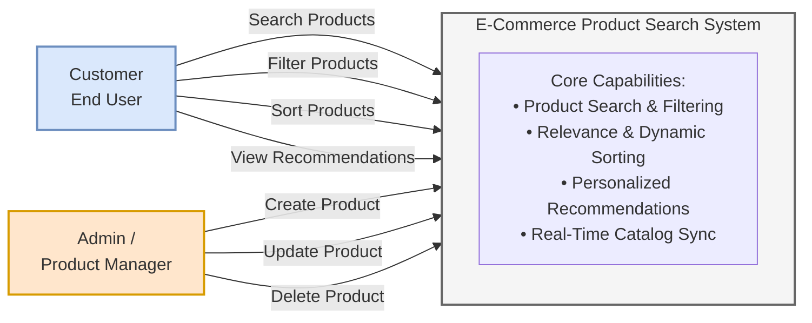

# System Context Diagram

```mermaid
flowchart LR
    Customer[Customer\nEnd User]
    Admin[Admin /\nProduct Manager]

    subgraph SystemBoundary ["E-Commerce Product Search System"]
        SystemCore["Core Capabilities:\n• Product Search & Filtering\n• Relevance & Dynamic Sorting\n• Personalized Recommendations\n• Real-Time Catalog Sync"]
    end

    Customer -->|Search Products| SystemBoundary
    Customer -->|Filter Products| SystemBoundary
    Customer -->|Sort Products| SystemBoundary
    Customer -->|View Recommendations| SystemBoundary

    Admin -->|Create Product| SystemBoundary
    Admin -->|Update Product| SystemBoundary
    Admin -->|Delete Product| SystemBoundary

    style SystemBoundary fill:#f5f5f5,stroke:#666666,stroke-width:2px;
    style Customer fill:#dae8fc,stroke:#6c8ebf,stroke-width:2px;
    style Admin fill:#ffe6cc,stroke:#d79b00,stroke-width:2px;
```
