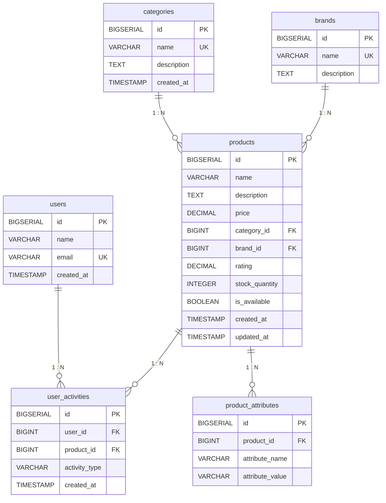

# Database ER Diagram

```mermaid
erDiagram
    users ||--o{ user_activities : "1 : N"
    products ||--o{ user_activities : "1 : N"
    categories ||--o{ products : "1 : N"
    brands ||--o{ products : "1 : N"
    products ||--o{ product_attributes : "1 : N"

    users {
        BIGSERIAL id PK
        VARCHAR name
        VARCHAR email UK
        TIMESTAMP created_at
    }

    categories {
        BIGSERIAL id PK
        VARCHAR name UK
        TEXT description
        TIMESTAMP created_at
    }

    brands {
        BIGSERIAL id PK
        VARCHAR name UK
        TEXT description
    }

    products {
        BIGSERIAL id PK
        VARCHAR name
        TEXT description
        DECIMAL price
        BIGINT category_id FK
        BIGINT brand_id FK
        DECIMAL rating
        INTEGER stock_quantity
        BOOLEAN is_available
        TIMESTAMP created_at
        TIMESTAMP updated_at
    }

    product_attributes {
        BIGSERIAL id PK
        BIGINT product_id FK
        VARCHAR attribute_name
        VARCHAR attribute_value
    }

    user_activities {
        BIGSERIAL id PK
        BIGINT user_id FK
        BIGINT product_id FK
        VARCHAR activity_type
        TIMESTAMP created_at
    }
```
