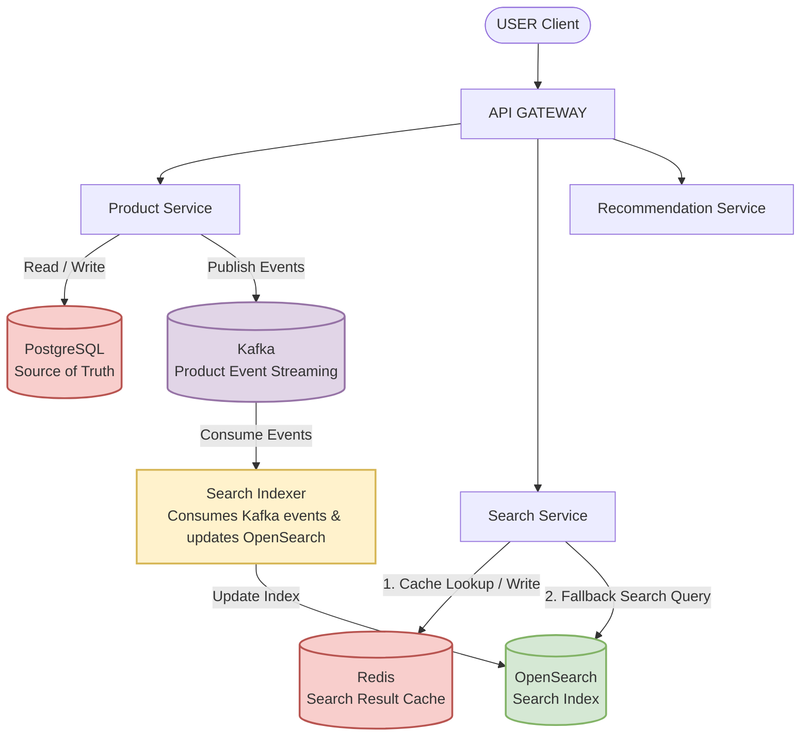

# High-Level Architecture Diagram

```mermaid
flowchart TD
    User([USER Client]) --> Gateway[API GATEWAY]
    
    Gateway --> ProdService[Product Service]
    Gateway --> SearchService[Search Service]
    Gateway --> RecService[Recommendation Service]

    ProdService -->|Read / Write| PG[(PostgreSQL\nSource of Truth)]
    ProdService -->|Publish Events| Kafka[(Kafka\nProduct Event Streaming)]

    SearchService -->|1. Cache Lookup / Write| Redis[(Redis\nSearch Result Cache)]
    SearchService -->|2. Fallback Search Query| OpenSearch[(OpenSearch\nSearch Index)]

    Kafka -->|Consume Events| Indexer[Search Indexer\nConsumes Kafka events & updates OpenSearch]
    Indexer -->|Update Index| OpenSearch

    style PG fill:#f8cecc,stroke:#b85450,stroke-width:2px;
    style Redis fill:#f8cecc,stroke:#b85450,stroke-width:2px;
    style Kafka fill:#e1d5e7,stroke:#9673a6,stroke-width:2px;
    style OpenSearch fill:#d5e8d4,stroke:#82b366,stroke-width:2px;
    style Indexer fill:#fff2cc,stroke:#d6b656,stroke-width:2px;
```
