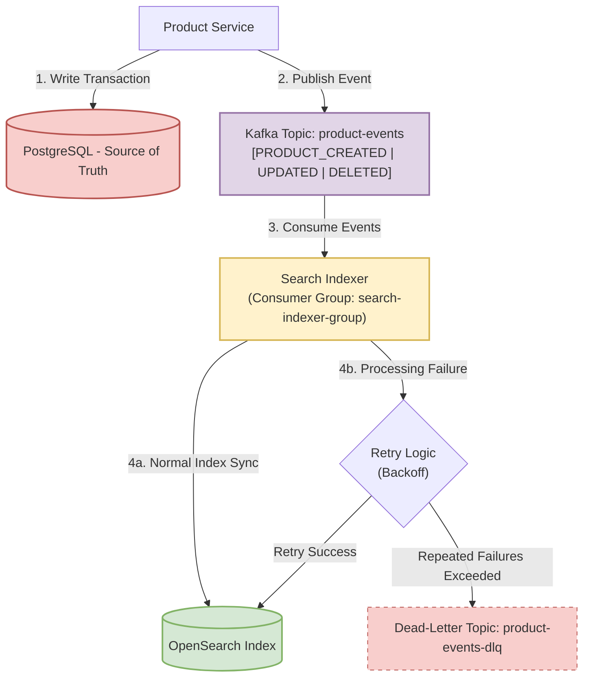

# Kafka Event Flow & DLQ Architecture

```mermaid
flowchart TD
    ProductService[Product Service] -->|1. Write Transaction| PG[(PostgreSQL - Source of Truth)]
    ProductService -->|2. Publish Event| KafkaTopic["Kafka Topic: product-events\n[PRODUCT_CREATED | UPDATED | DELETED]"]
    
    KafkaTopic -->|3. Consume Events| Indexer["Search Indexer\n(Consumer Group: search-indexer-group)"]
    
    Indexer -->|4a. Normal Index Sync| OpenSearch[(OpenSearch Index)]
    
    Indexer -->|4b. Processing Failure| RetryMechanism{"Retry Logic\n(Backoff)"}
    RetryMechanism -->|Retry Success| OpenSearch
    RetryMechanism -->|Repeated Failures Exceeded| DLQ["Dead-Letter Topic: product-events-dlq"]

    style PG fill:#f8cecc,stroke:#b85450,stroke-width:2px;
    style KafkaTopic fill:#e1d5e7,stroke:#9673a6,stroke-width:2px;
    style Indexer fill:#fff2cc,stroke:#d6b656,stroke-width:2px;
    style OpenSearch fill:#d5e8d4,stroke:#82b366,stroke-width:2px;
    style DLQ fill:#f8cecc,stroke:#b85450,stroke-dasharray: 5 5;
```
