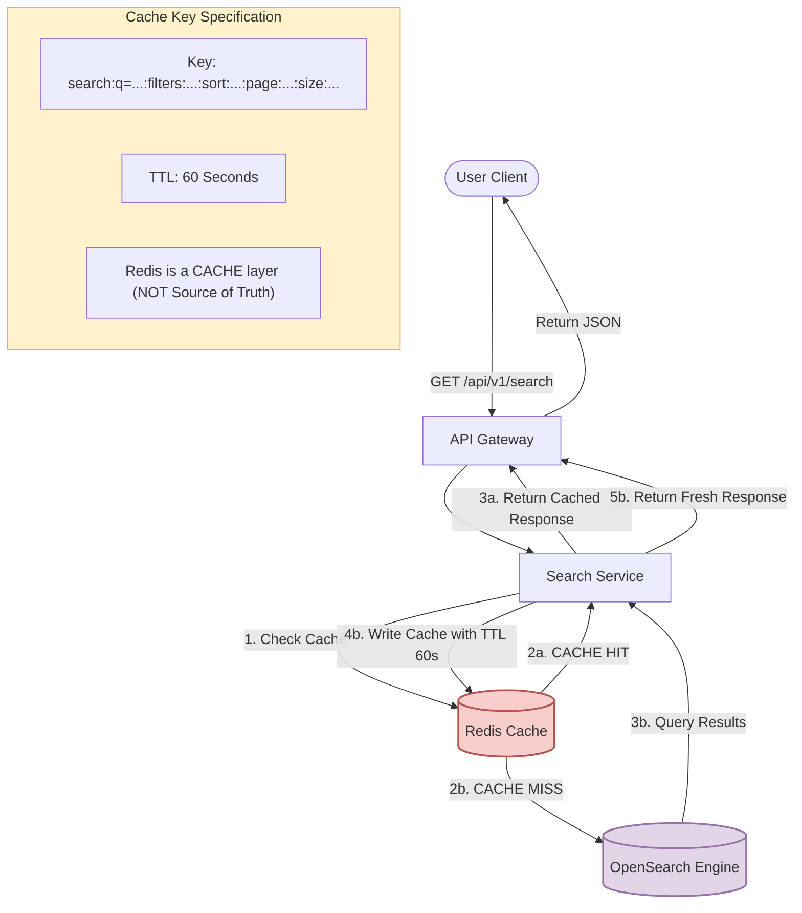

# Redis Cache Architecture & Flow Diagram

```mermaid
flowchart TD
    User([User Client]) -->|GET /api/v1/search| Gateway[API Gateway]
    Gateway --> Search[Search Service]
    Search -->|1. Check Cache| Redis[(Redis Cache)]
    
    subgraph KeySpec ["Cache Key Specification"]
        KeyFormat["Key: search:q=...:filters:...:sort:...:page:...:size:..."]
        TTLFormat["TTL: 60 Seconds"]
        RoleNote["Redis is a CACHE layer (NOT Source of Truth)"]
    end

    Redis -->|2a. CACHE HIT| Search
    Search -->|3a. Return Cached Response| Gateway
    Gateway -->|Return JSON| User

    Redis -->|2b. CACHE MISS| OpenSearch[(OpenSearch Engine)]
    OpenSearch -->|3b. Query Results| Search
    Search -->|4b. Write Cache with TTL 60s| Redis
    Search -->|5b. Return Fresh Response| Gateway

    style Redis fill:#f8cecc,stroke:#b85450,stroke-width:2px;
    style OpenSearch fill:#e1d5e7,stroke:#9673a6,stroke-width:2px;
    style KeySpec fill:#fff2cc,stroke:#d6b656,stroke-width:1px;
```
