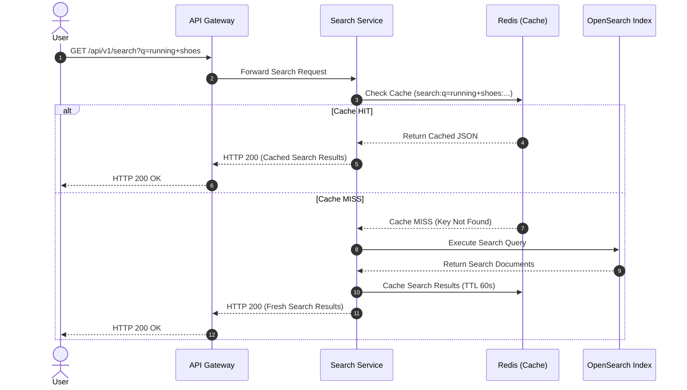

# Product Search Sequence Diagram

```mermaid
sequenceDiagram
    autonumber
    actor User
    participant Gateway as API Gateway
    participant Search as Search Service
    participant Redis as Redis (Cache)
    participant OpenSearch as OpenSearch Index

    User->>Gateway: GET /api/v1/search?q=running+shoes
    Gateway->>Search: Forward Search Request
    Search->>Redis: Check Cache (search:q=running+shoes:...)
    
    alt Cache HIT
        Redis-->>Search: Return Cached JSON
        Search-->>Gateway: HTTP 200 (Cached Search Results)
        Gateway-->>User: HTTP 200 OK
    else Cache MISS
        Redis-->>Search: Cache MISS (Key Not Found)
        Search->>OpenSearch: Execute Search Query
        OpenSearch-->>Search: Return Search Documents
        Search->>Redis: Cache Search Results (TTL 60s)
        Search-->>Gateway: HTTP 200 (Fresh Search Results)
        Gateway-->>User: HTTP 200 OK
    end
```
