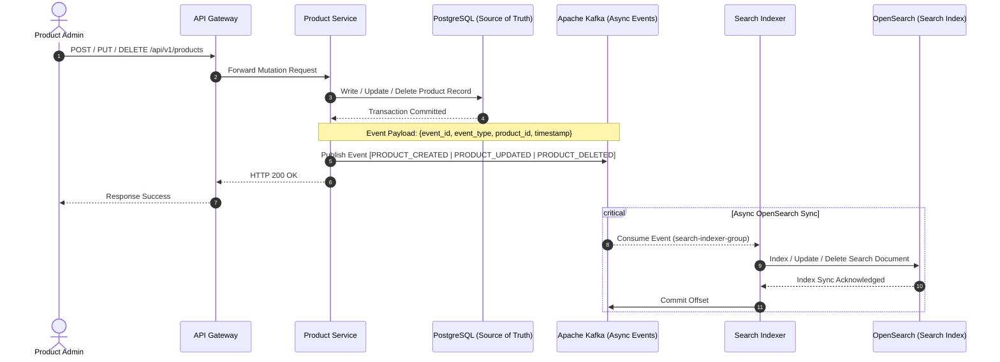

# Product Update / Kafka Sequence Diagram

```mermaid
sequenceDiagram
    autonumber
    actor Admin as Product Admin
    participant Gateway as API Gateway
    participant ProdService as Product Service
    participant PG as PostgreSQL (Source of Truth)
    participant Kafka as Apache Kafka (Async Events)
    participant Indexer as Search Indexer
    participant OS as OpenSearch (Search Index)

    Admin->>Gateway: POST / PUT / DELETE /api/v1/products
    Gateway->>ProdService: Forward Mutation Request
    ProdService->>PG: Write / Update / Delete Product Record
    PG-->>ProdService: Transaction Committed
    
    note over ProdService,Kafka: Event Payload: {event_id, event_type, product_id, timestamp}
    ProdService->>Kafka: Publish Event [PRODUCT_CREATED | PRODUCT_UPDATED | PRODUCT_DELETED]
    ProdService-->>Gateway: HTTP 200 OK
    Gateway-->>Admin: Response Success

    critical Async OpenSearch Sync
        Kafka-->>Indexer: Consume Event (search-indexer-group)
        Indexer->>OS: Index / Update / Delete Search Document
        OS-->>Indexer: Index Sync Acknowledged
        Indexer->>Kafka: Commit Offset
    end
```
